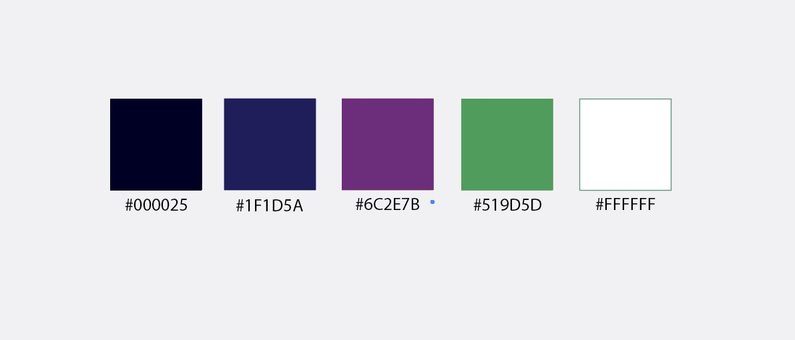
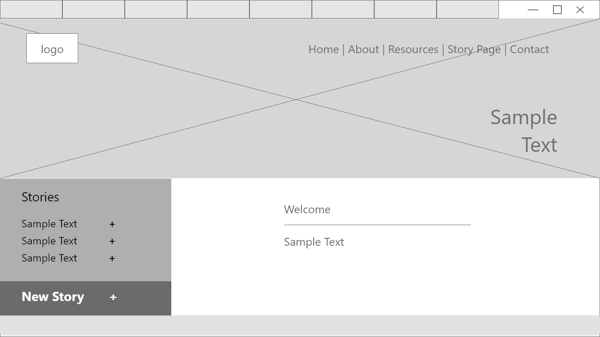
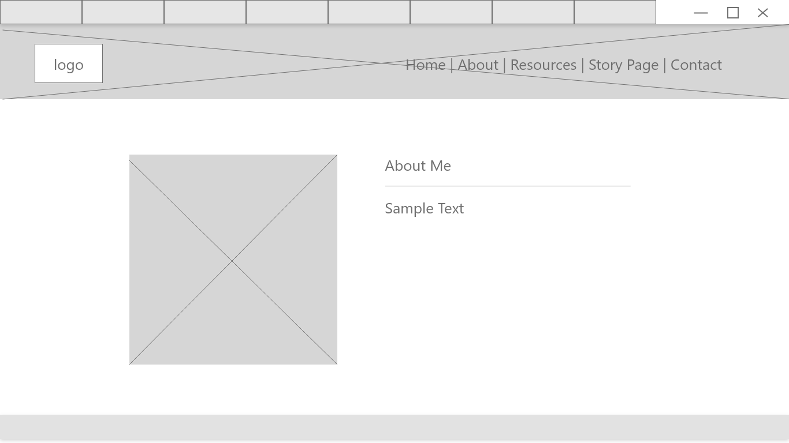
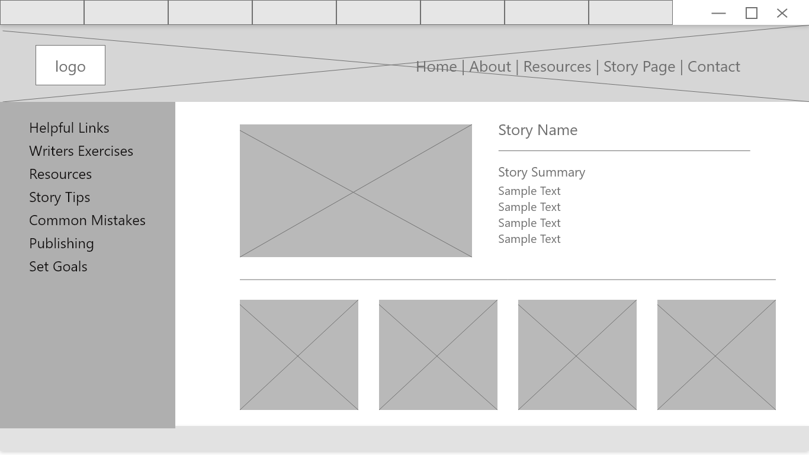
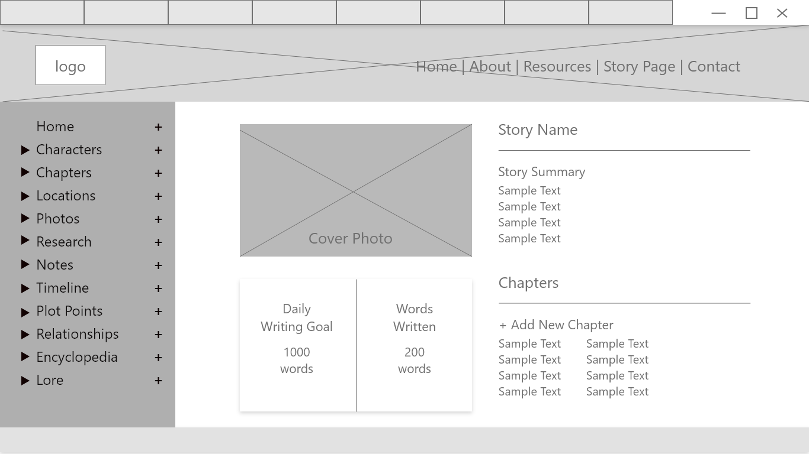
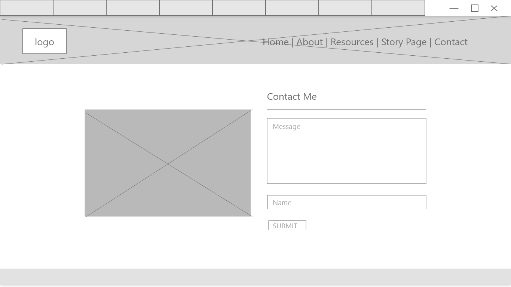
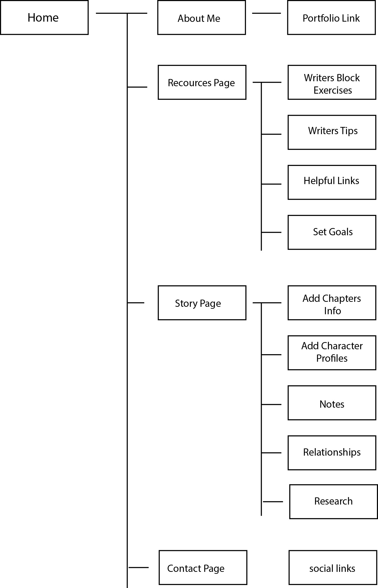

# Capstone Project Planning (InkWizard)

## Definition Statement
I want to build an application that helps writers log/keep track of important information for their stories such as… character profiles, plot points, world building info ect.

---

## Color Palette

---

## Define Audience
- Casual Writers
- Professional Writers
- Video Game Writers
- Writing Students
- D&D Players

---

## Content Outline

### Purpose of the Application
To give writers a way to document information related to their story such as... character info, plot points, worldbuilding info etc.

### What business problem or real world problem am I going to be solving?
Problem: Writers have a difficult time keeping track of information about their stories.

### What Do I Want On Each Page? (text / pics / images / navigation)

#### Homepage
(functionality: introduce the application)
- Images that highlight the fantasy aspect of story writing.
- Traditional style nav bar (no hamburger menu)
- Text that introduces the application.

#### About Page
(functionality: to introduce myself)
- Photo of myself.
- Text that introduces me, my skills and the reason I created the application.

#### Resources Page
(functionality: to give writers helpful resources)
- Links to useful resources for writers.
- Helpful tips for writers
- Simple exercises to help combat writers combat writers block

#### Story Page
(functionality: to log information related to the story)
- Photos of the story characters, world map, landscape photos.
- Character profiles, important locations, chapter summaries

#### Contact page
(functionality: to offer a way to contact me)
- contact form
-links to social media

---

## User Story Map Link
https://app.mural.co/t/madori8859/m/madori8859/1699581502636/361920cb57f1b62ead4db879319f6b28ac36db22?sender=u61e82509b1ec1d7808999654

---

## Competitor Research
https://www.campfirewriting.com/write/for-novelists?utm_source=youtube&utm_medium=video&utm_campaign=AN_Q4_22
- Likes: You can post and share your stories on their site, You can read other peoples stories, has many useful features
- Dislikes: So many features it's kinda overwhelming
- What I’ll do to be different: Have my site be a bit simpler

https://www.worldanvil.com/?gad_source=1&gclid=Cj0KCQiAjMKqBhCgARIsAPDgWlzdKIVRN3bpEdVlC-71GtYJ-o0d9WRPq_b9Nd3DtcjSpZ76F2SlHscaAvHoEALw_wcB
- Likes: Useful features for RPG players
- Dislikes: Design is bland, Not as intuitive as campfire
- What I’ll do to be different: Better design, Have a tag system

https://wavemakercards.com/
- Likes: Easy to navigate
- Dislikes: design is too simple/bland, has no tutorial, limited features
- What I’ll do to be different: Include a popup tutorial

---

## Wireframes

Home Page

About Page

Resources Page

Story Page

Contact Page

---

## User Flow Diagram

---

## SWOT Analysis Link

https://docs.google.com/document/d/1GzL5fSeSnXrOROq4O58momj1FHKFh7ZkVM2hgqTdxeM/edit?usp=sharing

---
